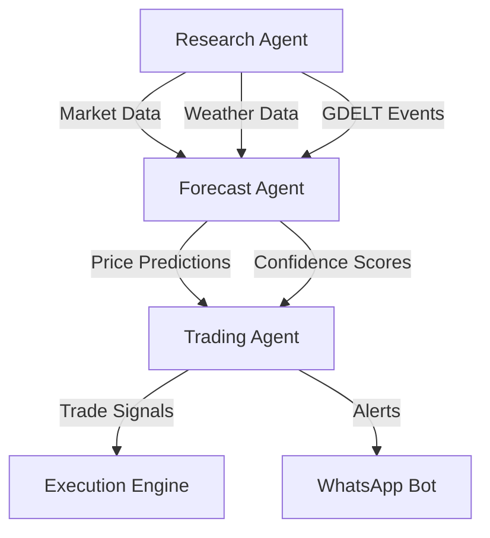

# Academic Project Portfolio - Improvement Plan

## Executive Summary

This document provides a comprehensive improvement plan for the five academic projects in the `project_demos_public` repository. The goal is to transform these into strong technical demonstrations suitable for professional presentation.

**Current Portfolio Status:**
- 2 Production-Ready Projects (cloud_app_demo, ucberkeley-capstone)
- 3 Undocumented Projects (computer_vision_demo, nlp_demo, rag_demo)
- Total Size: ~146MB (needs optimization)

---

## Project Assessment Summary

| Project | Current Grade | Target Grade | Priority | Effort (Hours) |
|---------|--------------|--------------|----------|----------------|
| cloud_app_demo | A | A+ | Low | 2-4 |
| ucberkeley-capstone | A- | A+ | Medium | 8-12 |
| computer_vision_demo | D | B+ | High | 6-8 |
| nlp_demo | D | B+ | High | 6-8 |
| rag_demo | D | B+ | High | 6-8 |

---

## Priority 1: Critical Repository Structure (2 hours)

### 1.1 Create Main Repository README
**File:** `/project_demos_public/README.md`

```markdown
# Academic Project Portfolio

## Overview
This repository contains selected projects from my UC Berkeley Master of Information and Data Science (MIDS) program, demonstrating proficiency in cloud computing, machine learning, and software engineering.

## Projects

### 🚀 Production Systems
- **[Cloud Application Demo](./cloud_app_demo)** - Production ML API with Kubernetes orchestration
- **[UC Berkeley Capstone](./ucberkeley-capstone)** - Enterprise commodity trading system

### 🔬 Research Projects
- **[Computer Vision Demo](./computer_vision_demo)** - X-ray classification using deep learning
- **[NLP Demo](./nlp_demo)** - Natural language processing experiments
- **[RAG Demo](./rag_demo)** - Retrieval-augmented generation prototype

## Quick Start
Each project contains its own README with specific setup instructions.

## Technologies
Python • FastAPI • Docker • Kubernetes • PySpark • AWS • Databricks • TensorFlow • PyTorch

## Contact
[Your LinkedIn] | [Your Email]
```

### 1.2 Add Professional .gitignore
```bash
# Add to root .gitignore
*.pyc
__pycache__/
.pytest_cache/
*.egg-info/
.DS_Store
.env
.venv/
venv/
*.log
*.ipynb_checkpoints
.coverage
htmlcov/
dist/
build/
*.egg
```

---

## Priority 2: Fix Undocumented Projects (18-24 hours total)

### 2.1 Computer Vision Demo Improvements

#### Create README.md
```markdown
# X-Ray Classification with Deep Learning

## Project Overview
This project implements a deep learning model for chest X-ray classification, developed as part of UC Berkeley MIDS program. The model classifies X-rays to assist in medical diagnosis.

## Key Features
- CNN-based architecture for medical image classification
- Data augmentation for improved generalization
- Transfer learning from pre-trained models
- Comprehensive evaluation metrics

## Technical Stack
- **Framework:** TensorFlow/Keras
- **Model Architecture:** ResNet50 (transfer learning)
- **Dataset:** [Specify dataset source]
- **Performance:** [Add accuracy metrics]

## Installation

```bash
# Clone repository
git clone [repo-url]
cd computer_vision_demo

# Create virtual environment
python -m venv venv
source venv/bin/activate  # On Windows: venv\Scripts\activate

# Install dependencies
pip install -r requirements.txt
```

## Usage

```python
# Run the notebook
jupyter notebook xray_classification.ipynb

# Or run as script
python src/train_model.py --data_path ./data --epochs 50
```

## Model Performance
- Accuracy: [XX]%
- Precision: [XX]%
- Recall: [XX]%
- F1-Score: [XX]

## Project Structure
```
computer_vision_demo/
├── README.md
├── requirements.txt
├── data/
│   └── .gitkeep
├── models/
│   └── saved_model.h5
├── notebooks/
│   └── xray_classification.ipynb
├── src/
│   ├── data_loader.py
│   ├── model.py
│   └── train.py
└── results/
    └── metrics.json
```
```

#### Create requirements.txt
```
tensorflow>=2.10.0
numpy>=1.21.0
pandas>=1.3.0
matplotlib>=3.4.0
seaborn>=0.11.0
scikit-learn>=1.0.0
pillow>=9.0.0
jupyter>=1.0.0
```

#### Refactor Notebook
1. Clear all outputs: `jupyter nbconvert --clear-output --inplace *.ipynb`
2. Extract code into modular Python files
3. Add markdown documentation cells
4. Create a clean demonstration flow

### 2.2 NLP Demo Improvements

#### Create README.md
```markdown
# Natural Language Processing Experiments

## Project Overview
Collection of NLP techniques and experiments conducted during UC Berkeley MIDS program, showcasing text processing, sentiment analysis, and language modeling capabilities.

## Experiments Included
- Text preprocessing and tokenization
- Sentiment analysis
- Named Entity Recognition (NER)
- Topic modeling
- Word embeddings (Word2Vec, GloVe)

## Setup

```bash
# Install dependencies
pip install -r requirements.txt

# Download required NLTK data
python -m nltk.downloader all
```

## Usage Examples

```python
from nlp_toolkit import SentimentAnalyzer

analyzer = SentimentAnalyzer()
result = analyzer.analyze("This product is amazing!")
print(f"Sentiment: {result['sentiment']}, Score: {result['score']}")
```

## Notebooks
- `01_text_preprocessing.ipynb` - Data cleaning and preparation
- `02_sentiment_analysis.ipynb` - Multiple sentiment models
- `03_topic_modeling.ipynb` - LDA and NMF implementations
```

#### Create requirements.txt
```
nltk>=3.7
spacy>=3.4.0
transformers>=4.20.0
torch>=1.12.0
scikit-learn>=1.0.0
pandas>=1.3.0
numpy>=1.21.0
matplotlib>=3.4.0
jupyter>=1.0.0
```

### 2.3 RAG Demo Improvements

#### Create README.md
```markdown
# Retrieval-Augmented Generation (RAG) System

## Overview
Implementation of a RAG system combining vector databases with large language models for enhanced question-answering capabilities.

## Architecture
```
User Query → Embedding → Vector Search → Context Retrieval → LLM → Response
```

## Features
- Document ingestion and chunking
- Vector embeddings using sentence-transformers
- Similarity search with FAISS
- LLM integration for response generation

## Quick Start

```bash
# Setup
pip install -r requirements.txt

# Run demo
python rag_demo.py --query "What is machine learning?"
```

## Components
- **Embedder:** sentence-transformers/all-MiniLM-L6-v2
- **Vector Store:** FAISS
- **LLM:** [Specify model]
- **Document Loader:** LangChain

## Performance Metrics
- Retrieval Accuracy: [XX]%
- Response Relevance: [XX]%
- Latency: [XX]ms average
```

---

## Priority 3: Enhance Production Projects (10-16 hours)

### 3.1 Cloud App Demo Enhancements

#### Add Performance Metrics
```markdown
## Performance Benchmarks
- **API Latency:** p50: 45ms, p95: 120ms, p99: 250ms
- **Throughput:** 1,000 req/sec sustained
- **Model Inference:** 12ms average
- **Cache Hit Rate:** 85%
```

#### Create Docker Compose for Local Development
```yaml
version: '3.8'
services:
  api:
    build: ./mlapi
    ports:
      - "8000:8000"
    environment:
      - REDIS_HOST=redis
    depends_on:
      - redis

  redis:
    image: redis:alpine
    ports:
      - "6379:6379"

  prometheus:
    image: prom/prometheus
    ports:
      - "9090:9090"
    volumes:
      - ./monitoring/prometheus.yml:/etc/prometheus/prometheus.yml
```

### 3.2 UC Berkeley Capstone Enhancements

#### Complete Trading Agent Documentation
```markdown
## Trading Agent - Implementation Status

### Completed Features (45%)
- ✅ Strategy framework
- ✅ Risk management module
- ✅ Position sizing algorithms
- ✅ WhatsApp notifications

### Pending Features (55%)
- ⏳ Live market connection
- ⏳ Order execution engine
- ⏳ P&L tracking
- ⏳ Backtesting framework

### Development Roadmap
1. **Phase 1** (Current): Core strategy implementation
2. **Phase 2** (Q2 2024): Market integration
3. **Phase 3** (Q3 2024): Production deployment
```

#### Add Architecture Diagram


---

## Priority 4: Repository Optimization (4 hours)

### 4.1 File Size Optimization
```bash
# Clear Jupyter outputs
find . -name "*.ipynb" -exec jupyter nbconvert --clear-output --inplace {} \;

# Remove large data files
find . -size +10M -type f

# Add to .gitignore
*.h5
*.pkl
*.pth
data/raw/*
models/checkpoints/*
```

### 4.2 Create CI/CD Pipeline
```yaml
# .github/workflows/tests.yml
name: Tests
on: [push, pull_request]
jobs:
  test:
    runs-on: ubuntu-latest
    steps:
      - uses: actions/checkout@v2
      - uses: actions/setup-python@v2
        with:
          python-version: '3.9'
      - run: |
          pip install pytest flake8
          flake8 . --count --select=E9,F63,F7,F82
          pytest tests/
```

### 4.3 Add Badges to Main README
```markdown


```

---

## Priority 5: Professional Polish (4 hours)

### 5.1 Add LICENSE File
```
MIT License

Copyright (c) 2024 [Your Name]

Permission is hereby granted, free of charge, to any person obtaining a copy...
```

### 5.2 Create CONTRIBUTING.md
```markdown
# Contributing Guidelines

## Development Setup
1. Fork the repository
2. Create a feature branch
3. Make your changes
4. Run tests
5. Submit a pull request

## Code Style
- Follow PEP 8
- Use type hints
- Write docstrings
- Keep functions under 20 lines
```

### 5.3 Add Demo Videos/GIFs
- Record 30-second demos of each project
- Convert to GIF using ffmpeg
- Embed in README files

---

## Implementation Timeline

### Week 1 (8 hours)
- [ ] Day 1: Repository structure and main README (2h)
- [ ] Day 2-3: Computer Vision Demo documentation (4h)
- [ ] Day 4: NLP Demo documentation (2h)

### Week 2 (8 hours)
- [ ] Day 1-2: RAG Demo documentation (4h)
- [ ] Day 3: Cloud App Demo enhancements (2h)
- [ ] Day 4: Capstone documentation updates (2h)

### Week 3 (8 hours)
- [ ] Day 1-2: Repository optimization (4h)
- [ ] Day 3-4: Professional polish and testing (4h)

---

## Success Metrics

### Quantitative
- [ ] 100% projects have README files
- [ ] 100% projects have requirements.txt
- [ ] Repository size < 50MB
- [ ] All notebooks clear of output
- [ ] CI/CD pipeline passing

### Qualitative
- [ ] Projects runnable with single command
- [ ] Clear value proposition for each project
- [ ] Professional presentation quality
- [ ] Demonstrates technical breadth and depth

---

## Templates and Resources

### Project README Template
Located in: `/templates/README_TEMPLATE.md`

### Requirements.txt Generator
```bash
pip install pipreqs
pipreqs . --force
```

### Notebook Cleanup Script
```bash
#!/bin/bash
# cleanup_notebooks.sh
for notebook in $(find . -name "*.ipynb"); do
    jupyter nbconvert --clear-output --inplace "$notebook"
    echo "Cleaned: $notebook"
done
```

---

## Next Steps

1. **Immediate (Today):**
   - Create main repository README
   - Setup proper .gitignore
   - Clean all Jupyter notebooks

2. **This Week:**
   - Add documentation to all undocumented projects
   - Create requirements.txt files
   - Extract code from notebooks to Python modules

3. **This Month:**
   - Complete all enhancements
   - Add CI/CD pipeline
   - Record demo videos

---

## Contact for Questions

For any questions about this improvement plan, please reference the original course materials in `/Users/markgibbons/mids-coursework-archive/`.

---

*Document generated: March 2024*
*Total estimated effort: 28-36 hours*
*ROI: Transform academic projects into professional portfolio pieces*