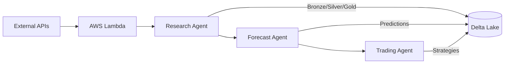

# Caramanta
{: .fs-9 }

## AI-Powered Commodity Trading Agent with Advanced Forecasting
{: .fs-6 .fw-300 }

UC Berkeley Master of Information and Data Science (MIDS) Capstone Project 2024
{: .label .label-blue }

[View Project on GitHub](https://github.com/gibbonstony/ucberkeley-capstone){: .btn .btn-primary .fs-5 .mb-4 .mb-md-0 .mr-2 }
[Live System](https://studiomios.wixstudio.com/caramanta){: .btn .fs-5 .mb-4 .mb-md-0 }

---

## Mission

Caramanta is an end-to-end AI-powered trading agent designed to forecast commodity prices and optimize trading strategies. We deliver actionable trading recommendations for coffee, cocoa, and sugar markets through a three-agent architecture that combines advanced machine learning, rigorous optimization, and real-time data processing.

## Key Achievements

### 90% Data Reduction
From 75,000 raw data points to 7,600 unified daily records while maintaining complete market coverage through forward-fill interpolation
{: .label .label-green }

### 180x Speedup
Evolution from V1 → V2 → V3 architecture achieved dramatic performance improvements through Spark parallelization and optimized data structures
{: .label .label-purple }

### 70% Accuracy Threshold
Rigorous statistical testing identified models achieving 70%+ directional accuracy, filtering from 15+ candidate models to high-confidence predictions
{: .label .label-yellow }

### 93% Compute Savings
"Fit many, publish few" strategy trains comprehensive model suite but deploys only statistically validated winners
{: .label .label-red }

---

## System Architecture

Caramanta uses a three-agent architecture deployed on Databricks with AWS infrastructure:

### Research Agent
**Data collection and ETL pipeline**
- 6 AWS Lambda functions collecting market, weather, and economic data
- S3 → Databricks Bronze → Silver → Gold medallion architecture
- Continuous daily data coverage since 2015-07-07
- [Read More →](../research_agent/README.md)

### Forecast Agent
**Machine learning forecasting engine**
- 15+ models: ARIMA, SARIMAX, Prophet, XGBoost, LSTM, TFT
- Parallel Spark backfills for efficient training
- "Fit many, publish few" model selection strategy
- [Read More →](../forecast_agent/README.md)

### Trading Agent
**Strategy optimization and execution**
- 9 trading strategies with parameter optimization
- Rolling horizon MPC for dynamic decision-making
- Statistical validation and performance tracking
- [Read More →](../trading_agent/README.md)

---

## Technology Stack

| Layer | Technologies |
|:------|:------------|
| **Data Platform** | Databricks, Delta Lake, Unity Catalog, PySpark |
| **Cloud Infrastructure** | AWS Lambda, S3, EventBridge |
| **ML Frameworks** | scikit-learn, Prophet, XGBoost, PyTorch (TFT, LSTM) |
| **Optimization** | SciPy, NumPy, Pandas |
| **Deployment** | Python 3.11, Git, Databricks Workflows |

---

## Navigation

  

    <h3><a href="results.html">Results & Metrics</a></h3>
    
Detailed performance analysis and key achievements

  

  

    <h3><a href="team.html">Team</a></h3>
    
Meet the UC Berkeley MIDS students behind Caramanta

  

  

    <h3><a href="../research_agent/README.html">Research Agent</a></h3>
    
Data collection, ETL pipeline, and unified data architecture

  

  

    <h3><a href="../forecast_agent/README.html">Forecast Agent</a></h3>
    
ML models, Spark parallelization, and forecasting methodology

  

  

    <h3><a href="../trading_agent/README.html">Trading Agent</a></h3>
    
Trading strategies, optimization, and execution

  

  

    <h3><a href="https://github.com/gibbonstony/ucberkeley-capstone">GitHub Repository</a></h3>
    
Full source code and implementation details

  

---

## Quick Start

### For Researchers
Start with the [Research Agent documentation](../research_agent/README.md) to understand our data architecture and ETL pipeline.

### For Data Scientists
Explore the [Forecast Agent documentation](../forecast_agent/README.md) for ML model implementations and Spark parallelization strategies.

### For Traders
Review the [Trading Agent documentation](../trading_agent/README.md) for trading strategies and optimization approaches.

---

## Project Timeline

| Phase | Duration | Deliverables |
|:------|:---------|:-------------|
| **Research & Data Collection** | Weeks 1-4 | Unified data architecture, AWS Lambda functions |
| **Model Development** | Weeks 5-10 | 15+ ML models, Spark parallelization |
| **Strategy Optimization** | Weeks 11-14 | 9 trading strategies, MPC controller |
| **Production Deployment** | Week 15 | End-to-end system, statistical validation |

---

## Contact

This is a capstone project for the UC Berkeley Master of Information and Data Science (MIDS) program.

For more information, visit our [live system](https://studiomios.wixstudio.com/caramanta) or explore the [GitHub repository](https://github.com/gibbonstony/ucberkeley-capstone).

---

<small>UC Berkeley MIDS Capstone 2024 | Built with ❤️ by Connor Watson, Stuart Holland, Francisco Munoz, and Tony Gibbons</small>
